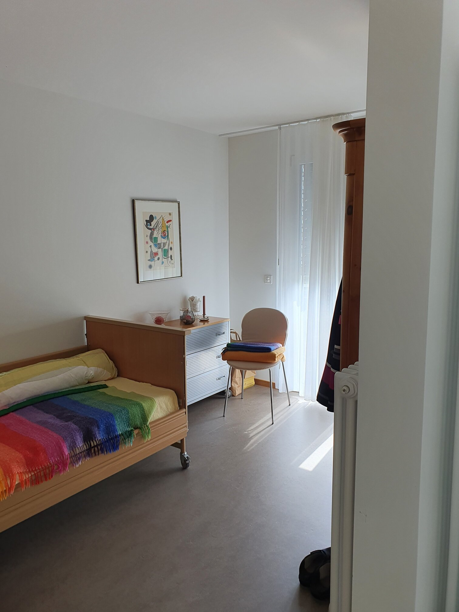

+++
title = "Unterwegs im Altersheim"
date = "2022-11-28"
draft = false
pinned = false
tags = ["Altersheim", "Pflege", "Reportage"]
image = "rsz_1rsz_320221006_141659.jpg"
description = "Wir begleiten Lea Läderach einen Nachmittag lang in ihrem Arbeitsalltag als diplomierte Pflegefachfrau und Abteilungsleiterin."
+++
\
Wir begleiten Lea Läderach einen Nachmittag lang in ihrem Arbeitsalltag als diplomierte Pflegefachfrau und Abteilungsleiterin. Ein Beruf, der viel Geduld und Empathie erfordert. Denn zu ihren Aufgaben gehört nicht nur die Pflege der Bewohnerinnen und Bewohner, sondern auch die Führung und Betreuung ihrer 21 Mitarbeiterinnen.

Es ist 12:45 Uhr an einem Donnerstagnachmittag. Ich und meine Kollegin Enya stehen vor dem Alters- und Pflegeheim Landblick in Beitenwil. Von aussen recht unscheinbar, ist im Inneren alles ruhig und einladend. Die Abteilungsleiterin Lea Läderach, die uns am Eingang empfängt, ist herzlich. Wir werden in die Garderoben geführt, wo wir unsere Arbeitskleidung bekommen: hellgrüne Hosen und ein weiss-grüner Kasack.

**Der Einsatz von Medikamenten** \
Nach einer kurzen Vorstellungsrunde beginnt der Rapport. Das Team bespricht, was am Morgen passiert ist und wie der Nachmittag aussehen wird. Frau Amacher (Name geändert) habe noch nichts gegessen, wenn möglich, solle das noch nachgeholt werden. 10 Minuten später machen sich alle auf, mit ihrer Arbeit zu beginnen. Wir begleiten Lea Läderach zum Medikamentenraum, wo sie die Medikamente der Bewohnerinnen und Bewohner für den Abend herrichtet. Auffallend ist die Menge. Fast alle Bewohnerinnen und Bewohner bekommen irgendein Medikament. Das sei eigentlich normal, erklärt uns Lea Läderach. Personen, die im Altersheim leben, sind in der Regel nicht mehr in der Lage, für sich selbst zu sorgen. Oft aufgrund von gesundheitlichen Problemen, die dann medikamentös behandelt werden. Beruhigungsmittel wie Zoldorm, Quetiapin und Relaxane werden häufig verabreicht. Aber nicht um die Bewohnerinnen und Bewohner ruhigzustellen, betont Lea Läderach. Ältere Personen hätten häufig den Drang mehr zu machen, als für sie gut ist. Jemand der geistig noch fit ist, dessen Körper aber nicht mehr so leistungsfähig ist, hat oft das Bedürfnis nach mehr Aktivitäten als der Körper verträgt. Die Beruhigungsmittel dienen dazu, sie vor Überanstrengung zu schützen und ihnen abends das Einschlafen zu erleichtern.\
Solche gängigen Medikamente muss Lea Läderach heute nicht mehr selbst richten. Sie werden bereits dosiert und sortiert aus der Apotheke geliefert. Lediglich stärkere Beruhigungs- und Schmerzmittel wie Palexia Ret und flüssige Medizin müssen noch von Hand sortiert und dosiert werden.

\
Lea Läderach (25) ist Abteilungsleiterin im Alters- und Pflegeheim Landblick in Beitenwil. Als solche koordiniert sie die Mitarbeiterinnen des Hauses A. Das sind 21 Frauen, darunter lernende und ausgebildete Fachfrauen Gesundheit (FaGe), Betagtenbetreuerinnen, Pflegeassistentinnen, Assistenzpersonal und eine Praktikantin. Lea Läderach hat im Alters- und Pflegeheim Sunneguet in Seftigen die Lehre als FaGe gemacht und arbeitet seither in der Pflege. Sie hat Praktika in der Spitex Wichtrach und im Salem Spital absolviert. Nach dem Abschluss der Ausbildung zur diplomierten Pflegefachfrau kam sie zur Landblick AG. Sie arbeitete zwei Jahre in Grosshöchstetten, seit Oktober 2022 arbeitet sie als Abteilungsleiterin in Beitenwil.

Zur Landblick AG gehören zwei Alters- und Pflegeheime an den Standorten Grosshöchstetten und Beitenwil. Die Heime umfassen insgesamt 122 Einzelbetten und 160 Mitarbeiter*innen. Die schönen Aussichten auf das Kiesen- und Aaretal geben den Heimen ihren Namen. Der Standort Beitenwil hat zwei Häuser. Im Haus A, dem Teil des Heimes den wir besucht haben, leben auf zwei Stockwerken 25 Menschen.\


**Die Tagesstruktur**\
Um 14:00 Uhr startet die Aktivierung. Heute ist das ein Konzert eines Schwyzerörgeli-Trios. Damit die Bewohnerinnen und Bewohner auch alle rechtzeitig am Konzert sind, werden sie noch einmal gefragt, ob sie hingehen wollen. Wir bringen sie dann nach unten ins Aufenthaltszimmer. Manche muss man im Rollstuhl hinrollen, andere werden begleitet. Während des Konzertes ist es auf der Abteilung ruhig, die meisten Bewohner\*innen sind beschäftigt. Deswegen nutzt das Pflegepersonal diese Zeit, um beispielsweise einen Rollator zu putzen, oder den wenigen Bewohner\*innen, die nicht ans Konzert gegangen sind, Gesellschaft zu leisten. Es sei eigentlich schon normal, dass am Nachmittag so wenig los ist, sagt Lea Läderach. Am Morgen und Abend gebe es am meisten zu tun. Um 16:00 Uhr hat der Frühdienst Feierabend und wird vom Spätdienst abgelöst.\
Um 17:30 gibt es Abendessen. Dafür kommen die meisten Bewohner\*innen in den Speisesaal. Viele brauchen dabei Hilfe, manche auch beim Essen. Der Spätdienst begleitet die Bewohner\*innen zurück in ihre Zimmer und verteilt die Medikamente. «Dann gehen die meisten Bewohner*innen früh ins Bett, also ab 18:15 Uhr», erzählt Frau Läderach.\
Morgens, wenn die Bewohnerinnen und Bewohner wieder aufstehen, werden sie je nach Bedarf gewaschen und gepflegt.

**Der Umgang mit Bewohnerinnen und Bewohnern**\
Wir sind mit Lea Läderach unterwegs, um die Bewohner*innen zu fragen, ob sie an der Aktivierung teilnehmen möchten. Uns fällt auf, wie viel Wert die Pflegerinnen auf das Wohlbefinden der Bewohnerinnen und Bewohner legen. Wir lernen Herrn Röthlisberger (Name geändert) kennen. Herr Röthlisberger ist stark schwerhörig. Um verstanden zu werden, muss Lea Läderach ihn regelrecht anschreien. Und selbst dann versteht er sie nur bedingt. Daher erklärt Lea Läderach ihm zwar mit lauter Stimme, aber trotzdem geduldig und freundlich, weshalb wir bei ihm sind.\
Der Pflegeberuf ist sicher nichts für Ungeduldige. Auch als wir etwas später einen anderen Bewohner besuchen, der uns auf die Frage, ob er ans Konzert wolle, mit Geschichten über seine Familie antwortet, reagiert die Pflegerin äussert geduldig und mit Verständnis. Die Pflegerinnen des Hauses A sind sehr einfühlsam und nehmen sich Zeit, auf die Bewohnerinnen und Bewohner einzugehen.\
Die Lehrtochter auf der Abteilung bekam die Aufgabe zu versuchen, Frau Amacher (die, wie im Rapport besprochen, noch nichts gegessen hat) doch noch zum Essen zu bewegen. Allerdings ist diese nur halbwach und kaum ansprechbar. Ihr muss das Essen löffelweise in den Mund geschoben werden. Frau Amacher kann noch selbst schlucken, allerdings nickt sie zwischen zwei Bissen immer wieder ein. Es benötigt unglaubliche Geduld und auch viel Verständnis für die Situation der Bewohnerin, um solch eine Aufgabe erledigen zu können.  

 

**Die Herausforderungen der Pflege**\
Der Umgang mit den Bewohnerinnen und Bewohnern ist nur eine der vielen Herausforderungen, denen das Pflegepersonal täglich gegenübersteht. Der Fachkräftemangel in der Pflege ist momentan gross. Das Haus A, das Lea Läderach leitet, ist zurzeit nicht unterbesetzt, aber mit Krankheitsausfällen wird die Abdeckung der Pflegeschichten dennoch knapp. So kommt es, dass Lehrlinge und Praktikant\*innen zum Teil die volle Verantwortung übernehmen müssen. Frau Läderach selbst muss häufig Überstunden machen, um Personalausfälle auszugleichen. Diese Überstunden sind unbezahlt, aber das Pflegepersonal kann bei Schichtende nicht einfach nach Hause gehen, wenn zu wenige Pfleger\*innen da sind, die Bewohnerinnen und Bewohner zählen schliesslich auf sie.\
Als die Aktivierung vorbei ist, können wir diesen Personalmangel selbst miterleben. Mehrere Dutzend Bewohner*innen wollen gleichzeitig in ihre Zimmer zurück. Einige können das selbstständig, aber die meisten müssen begleitet werden. Da dazu nicht genügend Pflegerinnen da sind, bekommen wir zwei auch je einen Rollstuhl in die Hand gedrückt. Die eine Bewohnerin ist aber dement und weiss daher nicht, in welchem Haus oder Zimmer sie wohnt. Wir finden uns dann mit zwei Bewohnerinnen im Lift wieder und wissen nicht recht wie weiter. Zum Glück kennt die zweite Bewohnerin ihr Zimmer und wir teilen uns auf, damit ich sie dorthin bringen kann, während Enya bei der anderen Bewohnerin bleibt. Ich begegne Lea Läderach und sie kann uns sagen, wohin wir die Bewohnerin bringen sollen.

> «Eine der grössten Herausforderungen in der Pflege sind die Angehörigen."\
> *Lea Läderach*

Trotz der Schwierigkeiten im Pflegealltag ist es wichtig, dass die Bewohnerinnen und Bewohner es nicht mitbekommen, wenn das Pflegepersonal gestresst oder das Team unterbesetzt ist. Natürlich gibt es auch Pflegerinnen, die weniger gut mit Stress umgehen können, und das merken die Bewohner*innen und läuten dann häufig noch dreimal mehr. Deswegen sagt Frau Läderach ihren Angestellten in solchen Fällen: «Hey, steht zuerst einmal vor der Türe, atmet tief durch und geht dann frisch in dieses Zimmer rein.»\
Eine weitere grosse Herausforderung sei der Umgang mit den Angehörigen der Bewohner*innen, sagt Frau Läderach. «Häufig haben die Angehörigen ihre Eltern oder Bekannten noch zuhause gepflegt, waren dann aber mit der Situation überfordert.» Die Eltern kämen dann ins Altersheim und das Abgeben der Pflege an das Pflegepersonal, den Fachkräften zu vertrauen, falle sehr Vielen sehr schwer.

**Die Schwierigkeiten der Abteilungsleitung**\
«Die Pflege ist ein sehr anstrengender Beruf. Körperlich, aber auch psychisch. Die Pflege muss rund um die Uhr gewährleistet sein, und die Entlöhnung ist nicht extrem hoch.» Deswegen ist es nicht so verlockend, in der Pflege zu arbeiten, gibt Lea Läderach zu bedenken. Man muss Menschen helfen und sie pflegen wollen. Denn, «reich kann man in der Pflege nicht werden.» Die suboptimalen Arbeitsbedingungen gekoppelt mit der relativ tiefen Entlöhnung führen dazu, dass viele den Pflegeberuf verlassen. Dies verschärft wiederum den Fachkräftemangel.

> «In der Pflege kann man nicht reich werden.»\
> *Lea Läderach*

\
Genau das wollte die Pflegeinitiative ändern. Sie wurde letzten Herbst vom Stimmvolk angenommen. Auf die Frage, ob sich denn seither schon etwas geändert habe, lacht Lea Läderach. Nein, sagt sie. Klar, der Pflegeberuf oder Gesundheitseinrichtungen allgemein, stünden jetzt in einem besseren Licht. Dies zum Teil aber auch dank der Covid-19-Pandemie, da die Menschen während dieser Zeit gemerkt hätten, wie relevant das Gesundheitssystem sei.\
Die Schweiz braucht ein funktionierendes Gesundheitssystem mit gut ausgebildeten Fachkräften. Die Situation muss verbessert werden, niemand hat etwas davon, wenn Menschen im Alter nicht mehr richtig betreut werden können, gerade vor dem Hintergrund der älter werdenden Gesellschaft.  \
Wenn Menschen im Alter Hilfe brauchen, ist das Altersheim nicht die einzige Möglichkeit. Die Spitex sei eine sehr gute Organisation und ihre Vision, die Menschen zu Hause zu betreuen, sei super, so Lea Läderach. Allerdings könne auch die Spitex ab einem gewissen Zeitpunkt die Pflege zu Hause nicht mehr gewährleisten. Deshalb sollten die Altersheime und die Spitex eigentlich Hand in Hand zusammenarbeiten.

Sobald alle Bewohnerinnen und Bewohner, die an der Aktivierung teilnahmen, wieder in ihren Zimmern sind, kehrt auf der Abteilung Ruhe ein. Es ist eine gemütliche und zufriedene Atmosphäre. Die letzte halbe Stunde unseres Besuches verläuft – abgesehen von einer kurzen Kaffeepause – ereignislos. Wir verlassen die Anlage mit einem guten Gefühl.

Die Bewohnerinnen und Bewohner des Hauses A leben in gemütlichen Zimmern mit schöner Aussicht. Das Pflegepersonal ist freundlich und hat immer etwas Zeit übrig, um mit den Bewohnerinnen und Bewohnern zu reden. Auch die Hauskatze Simba, die selbst nicht mehr die Jüngste ist, hilft mit, eine Atmosphäre der Ruhe und Behaglichkeit zu schaffen.

Text: Lara Renfer